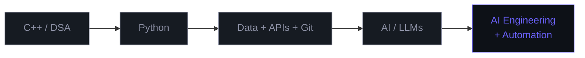
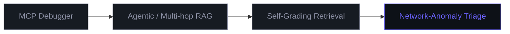
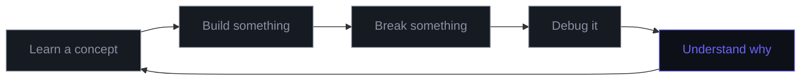

 

<h1 align="center">Laraib Zafar</h1>
<h4 align="center"><code>CS Student</code> &nbsp;→&nbsp; <code>AI Engineer in Training</code></h4>

  

  
  &nbsp;
  

 

## Where I'm Headed

I'm a Computer Science undergraduate building my way toward **AI engineering** through projects, experimentation, and deliberate learning.

> The goal isn't to collect technologies. It's to understand them well enough to build with them.

 

## Things I've Built

<table>
<tr>
<td width="33%" valign="top">

**DSA Friend**
A practice tool built around making data-structure problem solving more interactive.

`JavaScript` `HTML` `CSS`

</td>
<td width="33%" valign="top">

**Local RAG Pipeline**
A fully local retrieval-augmented generation pipeline. Debugged a retrieval-threshold issue along the way.

`ChromaDB` `SentenceTransformers` `Ollama` `Streamlit`

</td>
<td width="33%" valign="top">

**Security-Aware Reply Agent**
An experimental agent scaffold exploring prompt-injection resistance through a layered defense structure.

`Python`

</td>
</tr>
</table>

 

### What's Next

The common thread: building systems that can reason, retrieve, use tools, and fail more intelligently.

 

## What I'm Learning

<table>
<tr>
<td width="50%" valign="top">

**Python**
Data handling · NumPy / Pandas · File handling · APIs · Automation

</td>
<td width="50%" valign="top">

**AI**
LLM fundamentals · RAG · Embeddings · Agents & tool use · AI workflows

</td>
</tr>
<tr>
<td valign="top">

**Computer Science**
DSA in C++ · Problem solving · OOP · Systems thinking

</td>
<td valign="top">

**Security**
Prompt injection · AI red-teaming · Security-aware agents · Cybersecurity fundamentals

</td>
</tr>
</table>

 

## Tech Stack

 

## GitHub Stats

  
  

  
  

 

## How I Work

> Moving from *"I understand this when someone explains it"* to *"I can implement it myself and explain why it works."*

 

## Right Now

| | |
|---|---|
| **Location** | Lahore, Pakistan |
| **Focus** | AI Engineering · Python · DSA · Automation · AI + Security |
| **Building** | Projects over tutorials |
| **Philosophy** | Learn → Build → Break → Understand → Repeat |

 

