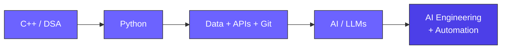
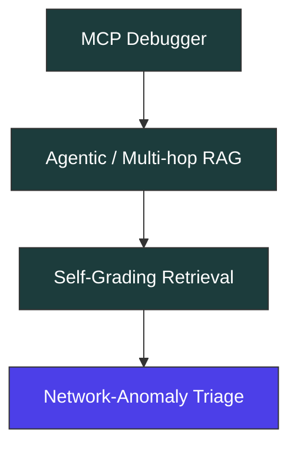
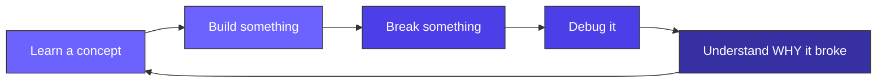

  

  
  
  

 

## 🧭 Where I'm Headed

I'm a Computer Science undergraduate building my way toward **AI engineering** through projects, experimentation, and deliberate learning.

My current path looks like this:

> **The goal isn't to collect technologies. It's to understand them well enough to build with them.**

 

## 🚀 Things I've Built

<table>
<tr>
<td width="33%" valign="top">

### 🧩 DSA Friend
A practice tool built around making data-structure problem solving more interactive.

`JavaScript` `HTML` `CSS`

</td>
<td width="33%" valign="top">

### 📚 Local RAG Pipeline
A fully local retrieval-augmented generation pipeline. Debugged a retrieval-threshold issue along the way.

`ChromaDB` `SentenceTransformers` `Ollama` `Streamlit`

</td>
<td width="33%" valign="top">

### 🛡️ Security-Aware Reply Agent
An experimental agent scaffold exploring prompt-injection resistance through a layered defense structure.

`Python`

</td>
</tr>
</table>

> Sometimes the interesting part isn't building the pipeline — it's finding out *why the pipeline isn't behaving the way you expected.*

 

### 🔭 What's Next

The common thread: **building systems that can reason, retrieve, use tools, and fail more intelligently.**

 

## 🧠 What I'm Learning

<table>
<tr>
<td width="50%">

**🐍 Python**
- Data handling
- NumPy / Pandas
- File handling
- APIs
- Automation

</td>
<td width="50%">

**🤖 AI**
- LLM fundamentals
- RAG
- Embeddings
- Agents & tool use
- AI workflows

</td>
</tr>
<tr>
<td>

**🧩 Computer Science**
- DSA in C++
- Problem solving
- OOP
- Systems thinking

</td>
<td>

**🔐 Security**
- Prompt injection
- AI red-teaming
- Security-aware agents
- Cybersecurity fundamentals

</td>
</tr>
</table>

 

## ⚡ My Tech Stack

 

## 📊 GitHub Stats

  
  

  
  

 

## 🏗️ How I Like to Learn

I'm particularly interested in moving from **"I understand this when someone explains it"** to:

> **"I can implement it myself and explain why it works."**

 

## 🌱 Beyond the Code

🎨 Sketching & painting &nbsp;·&nbsp; 🛼 Roller / ice skating &nbsp;·&nbsp; 🎬 Thriller / romcom movies &nbsp;·&nbsp; 📕 Reading &nbsp;·&nbsp; ✍️ Writing

 

## 📍 Right Now

| | |
|---|---|
| 📍 **Location** | Lahore, Pakistan 🇵🇰 |
| 🎯 **Focus** | AI Engineering · Python · DSA · Automation · AI + Security |
| 🏗️ **Building** | Projects > Tutorials |
| 🧭 **Philosophy** | Learn → Build → Break → Understand → Repeat |

 

